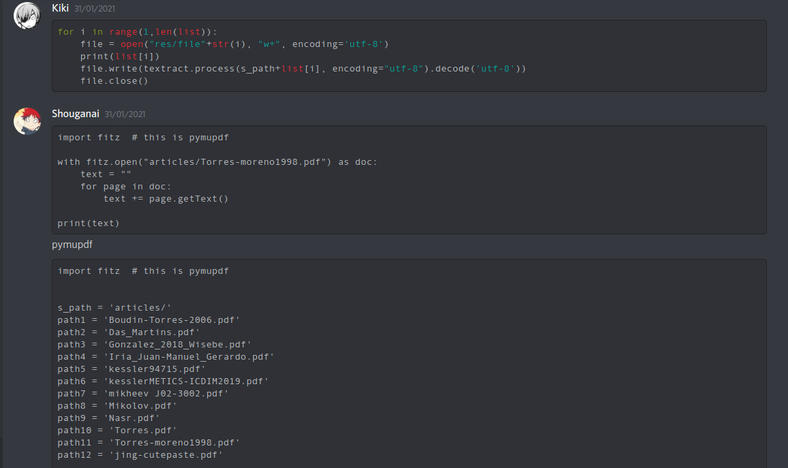
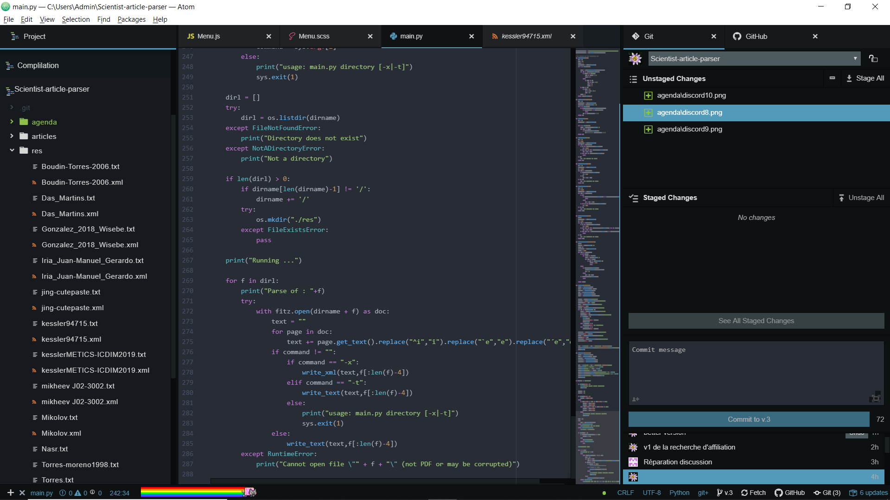

# Scientist-article-parser

## Nos réunions

Notre première semaine 

Notre Seconde semaine

Notre troisième semaine

## Principe

Explication du système :

  Le programme prend en argument un repertoire, qui va analyser chaque pdf pour 
trouver le nom , le(s) auteur(s) et l'abstract (si ces sections existent).

  Pour chaque pdf, le main du programme va prendre le PDF convertis en plain 
text,le spliter pour analyser ligne par ligne le texte, pour trouver les diffé-
rentes sections nous sommes partis de plusieurs observations :

    - Le titre du document est dans les 5 premières lignes .
    - Le titre ne possède pas de chiffres 
    - Les auteurs sont inscrit juste après le titre
    - Il peut y avoir des informations complémentaires concernant les auteurs,
      le texte suivant est soit l'abstract ou l'introduction
    - Concernant l'abstract, on peut trouver le mot clé "abstract", s'il n'est
      pas présent, on le situe avant l'introduction .

  Le programme commence par déterminer le titre qui se trouve sur les 5 premières
lignes. On supprime donc les lignes qui possèdent des chiffres, on obtient le 
nom de cet article .
  Le programme va ensuite utiliser la librairie "nltk" qui comporte des méthodes
permettant d'identifier des noms propres . On écrit le nom de chaque auteur dans 
le fichier texte.

Il existe 2 options -x et -t :
  La première option est pour la conversion en fichier xml
  La seconde option est pour la conversion en fichier txt
  Ps : Par défaut la conversion est en texte
  
Il faut aussi renseigner le path où résident les pdfs qu'on veux convertir!

#Exemple d'utilisation

python main.py [-x|-t| ] [path des pdf]

python main.py -x articles -> conversion en xml des pdfs dans le dossier articles 

## Nos réunions ♫

